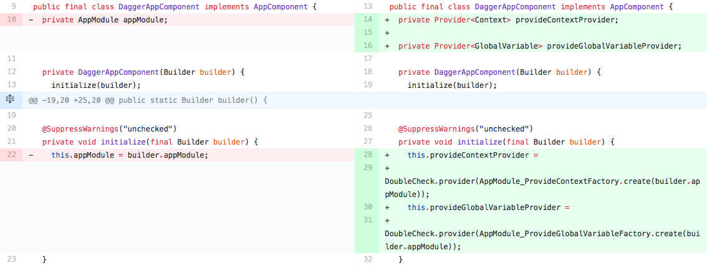

# 研究 Dagger的Scope 为什么 `@Singleton` 可以起到单例的作用

文件结构
├── components
│   ├── ActivityComponent.java
│   └── AppComponent.java
├── modules
│   └── AppModule.java
└── scopes
    ├── AppScope.java
    └── PerActivity.java
## 起因    
在项目中想使用一个全局变量，以前只是设计一个单例对象即可(static 全局变量)，但是静态全局变量对代码侵入很严重，还是想通过注入的方式使用，就直接在 `AppModule` 中添加了一个 `Provides` 但是使用时并没有起到单例的作用，之前还以为只要在 `AppModule` 中添加就会像是在 `Application` 中创建一样。

## @Singleton
又想到了使用 `Dagger` 中的 `@Singleton` 注解，直接在 `AppModule` 中添加 `@Singleton` 会
报错

```
Error:(16, 1) 错误: com.example.yunfei.dagger.components.AppComponent (unscoped) may not reference scoped bindings:
@Singleton @Provides com.example.yunfei.GlobalVariable com.example.yunfei.dagger.modules.AppModule.provideGlobalVariable()
```
必须在 `AppModle` 中也添加 `@Singleton` ，加完之后还是有问题

```
Error:(12, 1) 错误: com.example.yunfei.dagger.components.ActivityComponent (unscoped) cannot depend on scoped components:
@Singleton com.example.yunfei.dagger.components.AppComponent
```
`ActivityComponent` 没有作用域，就不能依赖一个有作用域的 `Component` ，当然你不能也给 `ActivityComponent` 也弄 `@Singleton` 也是会报错的，(可能是因为如果是同一个作用域就逻辑上就不应该分成两个 `Component` 这点我也不清楚，应该看下源码)
最终给 `ActivityComponent`添加了一个 `@PerAcivity`的作用域



```Java
 this.provideGlobalVariableProvider =        DoubleCheck.provider(AppModule_ProvideGlobalVariableFactory.create(builder.appModule));
```

原因在于 `DoubleCheck`

```Java
public T get() {
    Object result = instance;
    if (result == UNINITIALIZED) {
      synchronized (this) {
        result = instance;
        if (result == UNINITIALIZED) {
          result = provider.get();
          /* Get the current instance and test to see if the call to provider.get() has resulted
           * in a recursive call.  If it returns the same instance, we'll allow it, but if the
           * instances differ, throw. */
          Object currentInstance = instance;
          if (currentInstance != UNINITIALIZED && currentInstance != result) {
            throw new IllegalStateException("Scoped provider was invoked recursively returning "
                + "different results: " + currentInstance + " & " + result + ". This is likely "
                + "due to a circular dependency.");
          }
          instance = result;
          /* Null out the reference to the provider. We are never going to need it again, so we
           * can make it eligible for GC. */
          provider = null;
        }
      }
    }
    return (T) result;
  }
```


